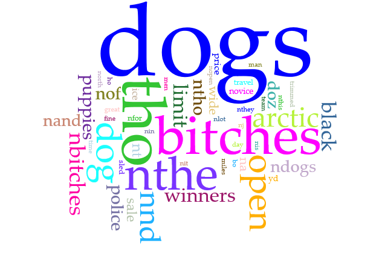

# what I was trying to do

gave the ole text analysis with voyant tutorial a whirl. 

+ tutorial: https://graddh.netlify.app/docs/tutorials/voyant/
+ repo: `[voyant](https://github.com/bad-d0nkey/digital_tune_up/voyant)`

## how it might connect to other research I'm doing

most of the work i do first involves text analysis. i learned from someone who knew her way around algorithm-assisted methods somewhat, but don't have a formal or comprehensive grounding. the work we are doing now requires more of me than i can deliver - and a lot more than manual processing makes sense for - so levelling up with tech skills is exactly what i need to do.

## what I did

+ step 1: ran through first steps of the tutorial (up to "going a bit further")
	+ nothing too fancy here
	+ downloaded the [newspaper data](cnd.xlsx)
	+ noted the [corpus address](https://voyant-tools.org/?corpus=248acb892019a723e6582caf4af99430) and played around with the different widgets for a query on the word "wales".
	+ captured the snippet for embedding a wales-related graphic 
		+ `<iframe style='width: 637px; height: 480px;' src='https://voyant-tools.org/tool/Trends/?query=wales&corpus=248acb892019a723e6582caf4af99430'></iframe>`
	
+ step 2: downloaded data to make my own corpus
	+ went to [Chronicling America](https://chroniclingamerica.loc.gov/) and decided to freestyle - i looked for "dogs" instead of archaeology and came up with this address to play with
		+  https://chroniclingamerica.loc.gov/search/pages/results/?state=&date1=1777&date2=1963&proxtext=dogs&x=0&y=0&dateFilterType=yearRange&rows=20&searchType=basic
		+ interestingly, there were more hits about dogs than about canada
	+ adapted the [python script](ca.py) to suit my query
	+ downloaded the [json data](data.json) and converted to [.xlsx](data.xlsx) using [json-csv](http://json-csv.com/)

+ step 3: created new corpus in voyant
	+ uploaded the json table
	+ selected the approriate options (for me, 45 and 16 + 43) on the landing page
	+ got myself [this](https://voyant-tools.org/?corpus=4f2fbfc002643d7b3296258a2d28804e) ungodly mess

+ step 4: investigated the corpus
	+ the OCRing evidently did not go so well - there is a lot of non-word soup that has entered into the corpus
	+ after digging around, i ultimately determined that, as the specific occurances of particular soupisms likely weren't too frequent, the results were probably good enough to discern patterns from 
	+ though, issues with token counts and general frequency would be askew... an example being the word "nand", the origin i can't figure out beyond perhaps the typeset being a fancy "a" 

+ step 5: played with the widgets
	+ 	

+ step 6: made a mental note that i could go "a lot further"
	+ my poor machine can't handle any more programs. i prefer using AntConc or wMatrix for corpus linguistic analysis, but for times when i want to stretch my investigation of the corpus, i may just consider this 
	 	
## challenges 

not so much on this one. anything that i didn't quite get i could easily investigate with the help manual. 

## thoughts on where to go next

i do want to actually work through the manual (tutorial? whatever it's called) from voyant and get to know this more formally. i've seen people do some interesting things with the program and it can't hurt to know more about how to use it. topic modelling, in particular, is of interest. i tried using voyant for this and got very strange results. more learning required.
